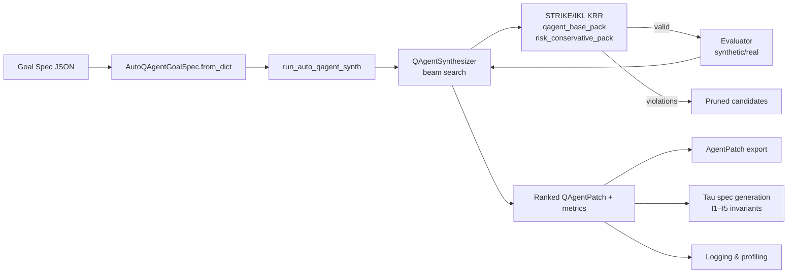
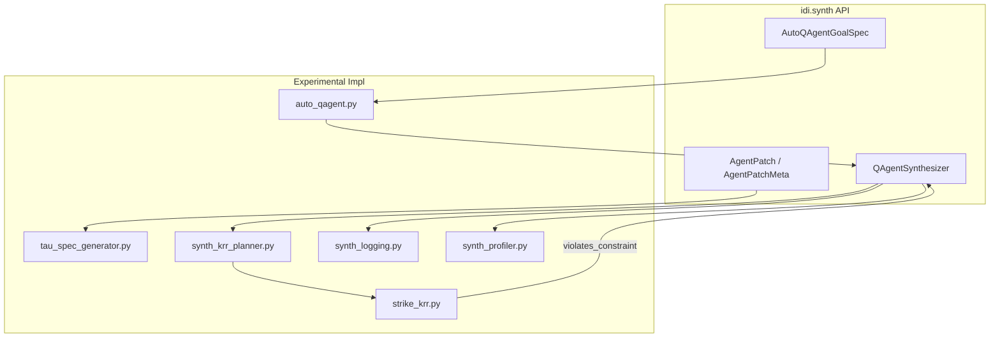
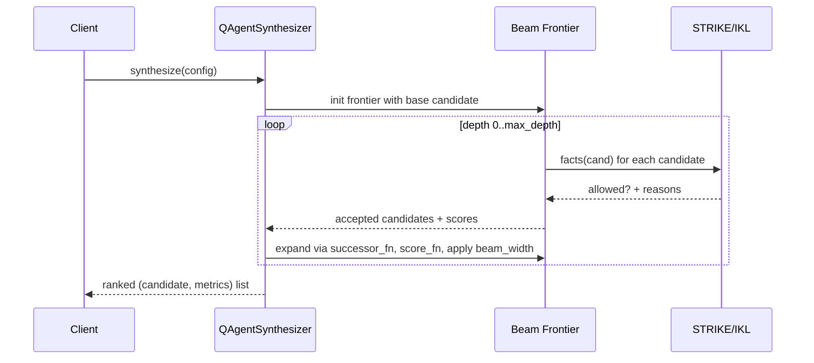

# Modular Synth & Auto-QAgent Overview

This document describes the **modular synth** backend and **Auto-QAgent**
automation layer in IDI, and how they fit into the broader IAN
architecture.

It is the **public entry point** for understanding:

- How `AgentPatch` and Q-Agents are synthesized
- How Auto-QAgent explores and evaluates candidate patches
- How KRR (STRIKE/IKL) invariants, Tau specs, and budgets keep search safe
- How to call the synth stack via the Python API and CLI

---

## 1. Goals

The modular synth stack has four main goals:

1. **Safe exploration** of agent designs under hard constraints
2. **Declarative configuration** via JSON goal specs (`AutoQAgentGoalSpec`)
3. **Strong invariants** enforced by KRR and Tau-compatible specs
4. **Production observability** (logging, profiling, testing)

In short: it lets you describe _what kind of Q-Agent you want_, then
safely explores the design space within strict resource limits.

---

## 2. Core Concepts

### 2.1 AgentPatch (idi.synth)

`AgentPatch` is a **generic, JSON-serializable configuration** for
agents. It captures:

- `AgentPatchMeta`: `id`, `name`, `description`, `version`, `tags`
- `agent_type`: e.g. `"qtable"`
- `payload`: family-specific config (for Q-Agents: bins, learning rates…)
- `spec_backend` / `spec_params`: hooks for KRR/Tau-side specs
- `zk_profile`: zero-knowledge / proof-related parameters

`idi.synth` exposes a stable API:

- `AgentPatch`, `AgentPatchMeta`
- `load_agent_patch`, `save_agent_patch`
- `validate_agent_patch`
- `diff_agent_patches`

Validation includes bounds on string lengths and collection sizes to
prevent denial-of-service via oversized inputs.

### 2.2 QAgentPatch & QAgentSynthesizer

For Q-learning agents, the synth stack uses a more specialized
`QAgentPatch` plus `QAgentSynthesizer` (re-exported via `idi.synth`).

`QAgentSynthesizer` performs **bounded beam search** over candidate
Q-agent configurations. Each candidate is:

- Evaluated with either a **synthetic metric** (fast, deterministic), or
- A short **real-mode backtest** via `QTrainer` (slower, higher-fidelity)

The search is guided by:

- **Metrics** (reward / risk / complexity)
- **KRR constraints** (STRIKE/IKL packs)
- **Resource limits** (beam width, depth, wall-clock budgets)

### 2.3 AutoQAgentGoalSpec

`AutoQAgentGoalSpec` is a JSON-serializable **goal spec** for
Auto-QAgent. It lets you declare:

- Which packs / profiles to use
- Which objectives to optimize (e.g. `avg_reward`, `risk_stability`)
- Training envs and weights
- Budgets: max agents, generations, episodes, wall-clock hours
- Output preferences: how many final agents and bundle format

The key entry points:

- `AutoQAgentGoalSpec.from_dict(data: Dict[str, Any])`
- `load_goal_spec(path: Path)` from JSON
- `run_auto_qagent_synth(goal)` → `(QAgentPatch, metrics)` list
- `run_auto_qagent_synth_agentpatches(goal)` → `AgentPatch` list

### 2.4 STRIKE/IKL KRR

`strike_krr.py` provides a **small Horn-rule engine** (STRIKE) and
knowledge packs (IKL) to express constraints such as:

- Maximum state size (price_bins × inventory_bins)
- Minimum discount factor
- Conservative learning rates and exploration
- ZK/Tau invariants (e.g., commitment / journal / tx hash statuses)

During synth, candidates are converted into facts (via `facts_fn`) and
run through KRR; any candidate that derives a `violates_constraint`
fact is pruned.

### 2.5 Tau Spec Generation

`tau_spec_generator.py` converts QAgent parameters into a **Tau spec**
with explicit invariants I1–I5:

- I1: bounded state size
- I2: minimum discount factor
- I3: maximum learning rate
- I4: maximum exploration rate
- I5: epsilon_end ≤ epsilon_start

You can generate specs for both `QAgentPatch` and `AgentPatch` and
optionally persist them to `.tau` files.

---

## 3. High-Level Architecture

```text
Goal Spec (JSON) ──▶ AutoQAgentGoalSpec
                          │
                          ▼
                 run_auto_qagent_synth
                          │
        ┌─────────────────┴─────────────────┐
        ▼                                   ▼
 QAgentSynthesizer (beam search)      Evaluator
    (candidates, profiles)         (synthetic or real)
        │                                   │
        ▼                                   │
  KRR (STRIKE/IKL)                          │
 (qagent_base, risk packs)                  │
        │                                   │
        └─────── valid candidates ◀─────────┘
                          │
                          ▼
                 AgentPatch exports
                 Tau spec generation
                 Logging + profiling
```

---

## 4. Quick Start

### 4.1 Python API (idi.synth)

Minimal example (pseudo-code, see `idi.synth` docs for details):

```python
from pathlib import Path
from idi.synth import (
    AgentPatch,
    AgentPatchMeta,
    load_agent_patch,
    save_agent_patch,
    validate_agent_patch,
    AutoQAgentGoalSpec,
    run_auto_qagent_synth_agentpatches,
)

# Load goal spec from JSON
from idi.devkit.experimental.auto_qagent import load_goal_spec

goal = load_goal_spec(Path("examples/synth/conservative_qagent_goal.json"))

# Run Auto-QAgent synth and get AgentPatch results
patches: list[AgentPatch] = run_auto_qagent_synth_agentpatches(goal)

# Validate & persist
for p in patches:
    validate_agent_patch(p)
    out = Path("artifacts") / f"{p.meta.id}.agentpatch.json"
    save_agent_patch(p, out)
```

### 4.2 CLI Usage

The synth stack is also reachable via CLI entry points (see
`examples/synth/README.md` for concrete commands):

- `idi dev-auto-qagent --goal examples/synth/conservative_qagent_goal.json ...`
- `idi patch-validate`, `patch-create`, `patch-diff`, `patch-apply`

These commands are covered by regression tests in
`idi/tests/test_cli_patch.py`.

---

## 5. Safety & Invariants

Safety rests on three layers:

1. **Input validation**
   - Hard bounds on string lengths, tag counts, dict sizes
   - Clamping of numeric budgets and training parameters
2. **KRR invariants (STRIKE/IKL)**
   - `qagent_base_pack` ensures bounded state size and minimum discount
   - `risk_conservative_pack` constrains learning rate and exploration
   - ZK/Tau packs enforce cryptographic status invariants
3. **Tau specs & local checks**
   - `tau_spec_generator.py` encodes I1–I5 as Tau constraints
   - `validate_patch_against_spec` checks invariants locally

In addition, Auto-QAgent enforces **resource budgets**:

- Episode counts and generations are clamped to sane ranges
- Wall-clock budgets enforced via `SynthTimeoutError`
- Real-mode evaluation guarded by `_safe_evaluate_patch_real`, which
  returns safe fallback metrics on failures rather than crashing

---

## 6. Observability & Profiling

### 6.1 Structured Logging

`synth_logging.py` provides:

- `SynthRunConfig`, `SynthRunStats`, `SynthRunLog`
- `SynthLogger` context manager for structured, JSON-friendly logs

You can wrap synth runs and record:

- Beam width, depth, profiles, eval mode
- Candidate counts (visited, pruned, accepted)
- Run duration and any errors

### 6.2 Performance Profiling

`synth_profiler.py` provides:

- `SynthProfiler`: context manager to time operations
- `profile_synth_run(fn, ...)` → `(result, ProfileReport)`
- `benchmark_evaluator(evaluator, patches)`

`ProfileReport.summary()` prints a breakdown of time spent in KRR,
QTrainer, mutation, etc., and can be used to tune beam width, depth,
and budgets.

---

## 7. Testing & Quality

Key test suites for the synth and Auto-QAgent stack:

- Property-based tests:
  - `test_agent_patch_pbt.py` – AgentPatch round-trips and validation
  - `test_beam_search_pbt.py` – KRR-guided beam search properties
- Fuzz & robustness:
  - `test_goal_spec_fuzz.py` – fuzzing `AutoQAgentGoalSpec.from_dict`
- Integration tests:
  - `test_auto_qagent_integration.py` – synthetic + mocked real mode
  - `test_krr_formal_spec.py` – KRR invariants and pack composition
- Tau spec & profiling:
  - `test_tau_spec_generator.py` – Tau spec generation & validation
  - `test_synth_profiler.py` – profiling utilities

These tests are designed to catch:

- Violations of formal invariants (I1–I5)
- Incorrect KRR pack usage or selection
- Sorting / ranking errors in multi-objective results
- Robustness issues in JSON parsing and type coercion

---

## 8. Where to Go Next

- **Architecture:** `docs/IDI_IAN_ARCHITECTURE.md`
- **Threat model:** `docs/THREAT_MODEL.md`
- **Simulation results:** `docs/SIMULATION_RESULTS.md`
- **Synth/Auto-QAgent internals:** `Internal/AGENT_MODULAR_SYNTHESIZER_DESIGN.md` (internal only)

---

## 9. Visual Diagrams

The following Mermaid diagrams can be rendered in compatible markdown
viewers (e.g., GitHub, GitLab, VS Code with Mermaid extension, or
`mmdc` from `@mermaid-js/mermaid-cli`).

### 9.1 End-to-End Auto-QAgent Flow



### 9.2 Component Relationships



### 9.3 Beam Search + KRR Loop


