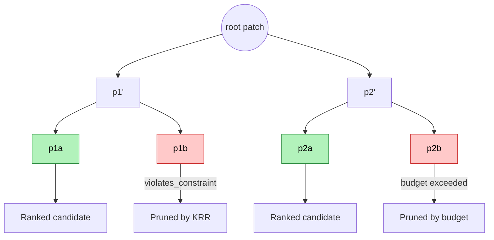
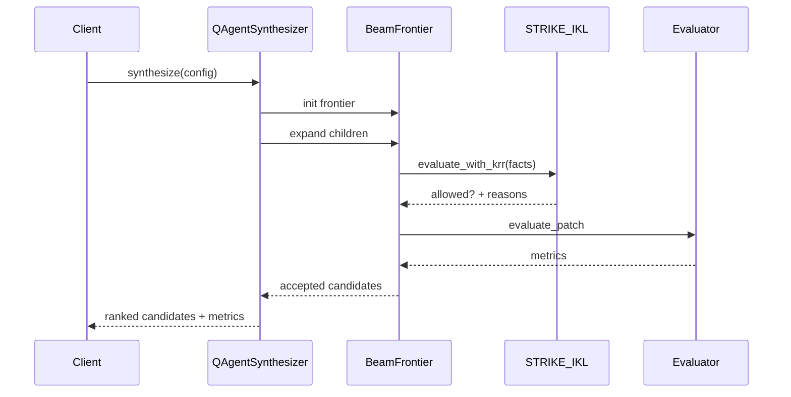
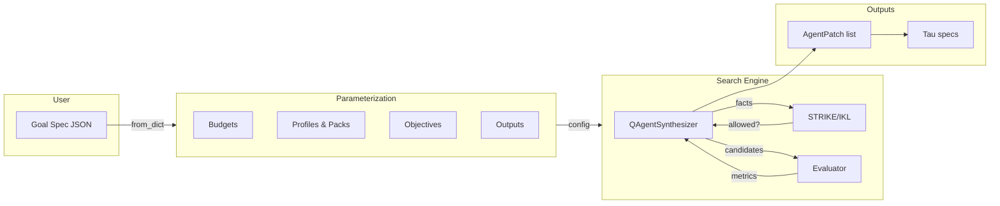

# Parameterization & Synth Visual Guide

This document provides **visual, diagram-first** explanations of:

- The **parameterization concept** in the modular synth / Auto-QAgent stack
- The **synthesizer concept** (beam search + KRR pruning + budgets)

It is meant for readers who think best in pictures.

---

## 1. Parameterization Layers

The synth stack treats parameters as a layered surface:

- User-facing JSON goal specs
- Synth / training budgets
- KRR packs and profiles
- Tau specs and invariants

### 1.1 Parameter Layers Overview

```mermaid
flowchart TB
    U[User Inputs (JSON, CLI, UI)] --> GS[Goal Spec (AutoQAgentGoalSpec)]

    GS --> B[Budgets]
    GS --> P[Profiles & Packs]
    GS --> O[Objectives]
    GS --> OUT[Outputs]

    B --> SC[Search Config]
    P --> KRR[Knowledge Packs]
    O --> RANK[Ranking Logic]
    OUT --> EXPORT[Exports]

    SC --> SYNTH[QAgentSynthesizer]
    KRR --> SYNTH
    RANK --> SYNTH

    SYNTH --> EXPORT
```

**Reading the diagram:**

- The **user only touches** the goal spec (and maybe CLI flags).
- That spec fans out into four internal surfaces:
  - **Budgets** → search depth/width and timeouts
  - **Profiles & Packs** → which KRR constraints are active
  - **Objectives** → which metrics to optimize
  - **Outputs** → how many patches to keep and in what format
- The synthesizer combines these into a **bounded, constrained search**.

---

## 2. Parameter Space vs. Safe Region

Another way to see parameterization is as a big space of possible
configurations, with only a **safe, bounded region** allowed by
invariants.

```mermaid
graph LR
    subgraph ALL[Full Parameter Space]
        A1((candidate A))
        A2((candidate B))
        A3((candidate C))
        A4((candidate D))
        A5((candidate E))
    end

    subgraph SAFE[Safe Region (I1-I5 + KRR)]
        S1((safe 1))
        S2((safe 2))
        S3((safe 3))
    end

    A1 -. pruned: state size too large .-> SAFE
    A2 -. pruned: discount too low .-> SAFE
    A3 -. pruned: learning rate too high .-> SAFE
    A4 --> S1
    A5 --> S2

    S1 -->|export| P1[AgentPatch 1]
    S2 -->|export| P2[AgentPatch 2]
```

**Key idea:**

- Parameterization is not just "more knobs" – it is a **constrained
  surface** of allowed configurations.
- KRR packs + Tau invariants **cut out** unsafe areas of the space.
- The synthesizer only ever explores and exports candidates inside the
  **safe region**.

---

## 3. Synthesizer Concept

The synthesizer is a **bounded beam search** over candidate patches,
pruned by KRR and ranked by metrics.

### 3.1 Search Tree with Pruning



- Each node is a **candidate patch** produced by mutations.
- KRR and budgets prune branches early.
- Remaining leaves are **ranked** by metrics & objectives.

### 3.2 Beam Search Timeline



- **Depth** and **beam_width** come from budgets / config.
- KRR and evaluator are **pure functions** from candidate to
  (allowed, metrics).

---

## 4. How Parameterization Guides Synth

We can combine the views above into a single picture:



**Takeaway:**

- **Parameterization** (goal spec layers) defines *what is allowed and
  desired*.
- The **synthesizer** implements *how to explore* that space safely.

---

## 5. Using These Diagrams

- For **conceptual onboarding**, start with:
  - 1.1 Parameter Layers Overview
  - 3.1 Search Tree with Pruning
- For **deep dives**, pair this document with:
  - `docs/MODULAR_SYNTH_AND_AUTO_QAGENT.md`
  - `docs/IDI_SYNTH_API.md`
  - `docs/MODULAR_SYNTH_QUALITY_AND_TESTING.md`
