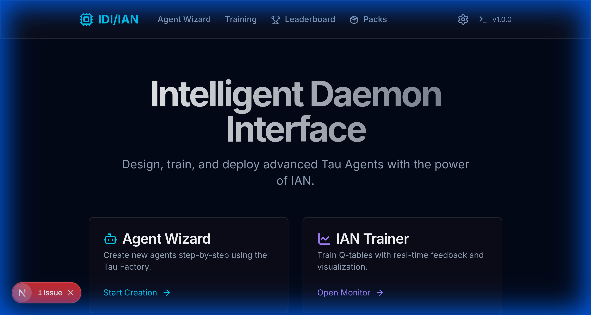
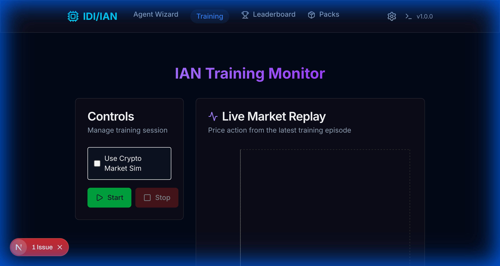
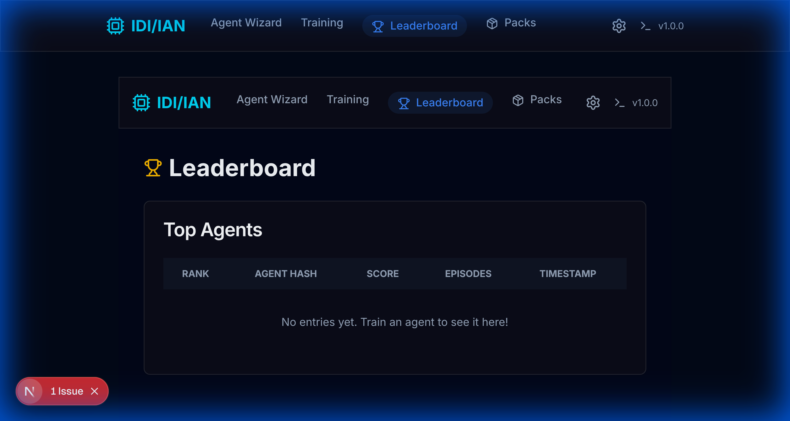
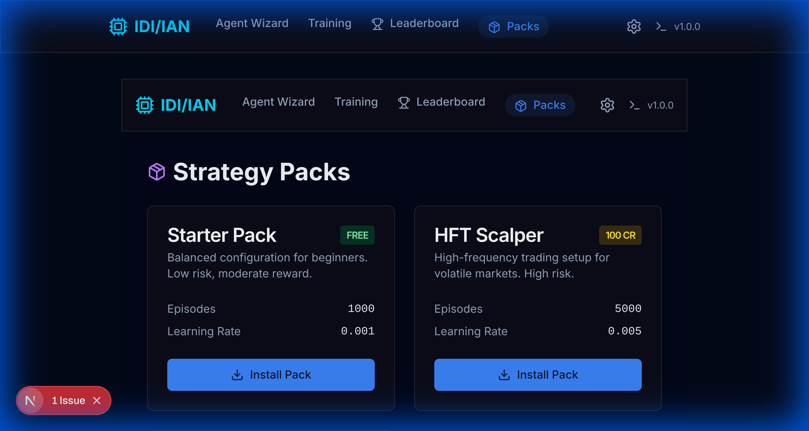
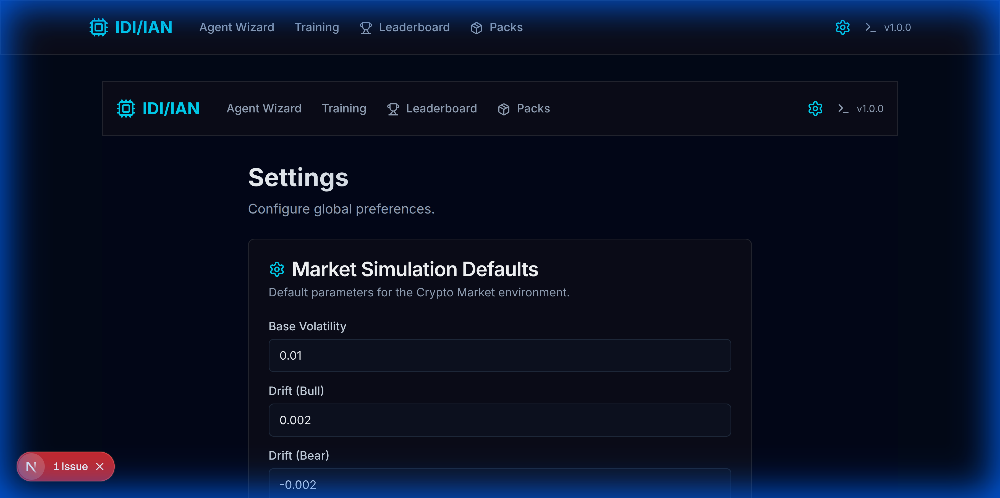
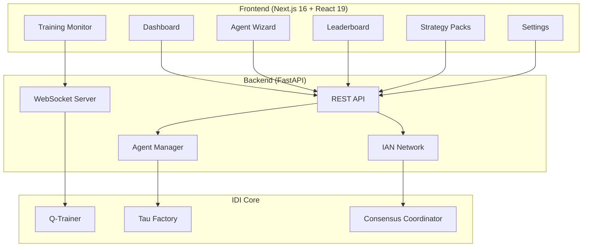

# IDI/IAN GUI Walkthrough

A comprehensive visual guide to the Intelligent Daemon Interface (IDI) and Intelligent Agent Network (IAN) GUI, demonstrating all core features for designing, training, and deploying Tau Agents.

---

## Overview

The IDI/IAN GUI is a modern web-based interface built with **Next.js 16** and **React 19**, featuring a sleek dark theme with glassmorphism design. It provides an intuitive workflow for:

- 🤖 **Creating agents** via a step-by-step wizard
- 🎯 **Training agents** with real-time visualization
- 🏆 **Viewing leaderboards** of top-performing agents
- 📦 **Installing strategy packs** from the marketplace
- ⚙️ **Configuring settings** for market simulation

---

## Getting Started

### Prerequisites

- Python 3.10+ with pip
- Node.js 18+ with npm
- The IDI project cloned and dependencies installed

### Launch the GUI

```bash
# From the project root
./run_gui.sh
```

This starts:
- **Backend** at `http://localhost:8000` (FastAPI)
- **Frontend** at `http://localhost:3000` (Next.js)

---

## Main Dashboard



The dashboard is your starting point. It features:

| Section | Description |
|---------|-------------|
| **Header** | Navigation bar with links to all main sections |
| **Agent Wizard Card** | Quick access to create new agents step-by-step |
| **IAN Trainer Card** | Launch the training monitor with real-time feedback |
| **My Agents** | Grid view of all saved agents with edit/delete options |

### Navigation

The top navbar provides quick access to:
- **Agent Wizard** - Create new agents
- **Training** - Monitor training sessions
- **Leaderboard** - View top agents
- **Packs** - Browse strategy packs
- **Settings** - Configure preferences

---

## Agent Wizard


The Agent Factory Wizard guides you through creating a new Tau Agent in 5 steps:

### Step 1: Strategy Selection
- Enter a unique **Agent Name**
- Choose a **Strategy**:
  - `Momentum` - Follows market trends
  - `Mean Reversion` - Bets against trends
  - `Regime Aware` - Adapts to market conditions
  - `Ensemble` - Combines multiple agents
  - `Custom` - Define your own

### Step 2: Input Selection
Select the data streams your agent will process:
- `q_buy`, `q_sell` - Q-table signals
- `price_up`, `price_down` - Price direction
- `trend`, `volume`, `regime` - Market indicators
- `risk_budget_ok` - Safety constraint

### Step 3: Layer Configuration
Configure the hierarchical processing depth (1-10 layers).

### Step 4: Safety Options
- **Include Safety Rails** - Prevents catastrophic actions
- **Enable Communication** - Allow agent to emit signals

### Step 5: Review & Generate
- Preview all configurations
- Visualize the agent's logic flow
- Generate the Tau specification
- Save to your agent library

> [!TIP]
> After generation, you can download the `.tau` specification file or save directly to your library.

---

## IAN Training Monitor



The Training Monitor provides live feedback during Q-table training:

### Controls Panel
- **Use Crypto Market Sim** toggle - Enable realistic market simulation
- **Sim Parameters** (when enabled):
  - Base Volatility (0.001 - 0.1)
  - Drift (bull/bear bias)
  - Fee (basis points)
- **Start/Stop** buttons

### Live Market Replay
Real-time price action chart showing the simulated market during training episodes.

### Reward History
Track agent performance across episodes with the reward plot.

### Status Bar
Live status indicator showing:
- 🟡 **Idle** - Ready to start
- 🟢 **Running** - Training in progress
- 🔵 **Completed** - Training finished successfully

---

## Leaderboard



The Leaderboard displays top-performing agents from the IAN network:

| Column | Description |
|--------|-------------|
| **Rank** | Position based on performance score |
| **Agent Hash** | Truncated unique identifier |
| **Score** | Performance metric from backtesting |
| **Episodes** | Number of training episodes completed |
| **Timestamp** | When the agent was submitted |

> [!NOTE]
> Agents are ranked by their backtested performance on the shared evaluation harness.

---

## Strategy Packs



Browse and install pre-configured strategy packs:

### Pack Cards
Each pack displays:
- **Name** and description
- **Price** (FREE or credits)
- **Configuration preview** (episodes, learning rate)
- **Install** button

### Available Packs
- Pre-configured agent strategies
- Community-contributed packs
- Premium optimization packs

> [!TIP]
> Installing a pack adds it to your agent library, ready for immediate training.

---

## Settings



Configure global preferences and defaults:

### Market Simulation Defaults
- **Base Volatility** - Default market volatility (e.g., 0.01)
- **Drift (Bull)** - Upward price bias (e.g., 0.002)
- **Drift (Bear)** - Downward price bias (e.g., -0.002)
- **Fee (bps)** - Transaction fee in basis points (e.g., 5.0)

Click **Save Changes** to persist your preferences.

---

## Technical Architecture



---

## Keyboard Shortcuts

| Key | Action |
|-----|--------|
| `Ctrl+Enter` | Submit current wizard step |
| `Escape` | Cancel current action |

---

## Need Help?

- 📖 See [IDI/IAN Architecture](../IDI_IAN_ARCHITECTURE.md) for technical details
- 🔧 Check [GUI Roadmap](../../GUI_ROADMAP.md) for planned features
- 🐛 Report issues on [GitHub Issues](https://github.com/your-repo/issues)
